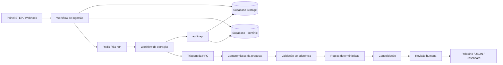

# Arquitetura da plataforma de auditoria

## 1. Objetivo

Automatizar a análise adversarial de oportunidades industriais, separando documentos do cliente e documentos da STEP, extraindo requisitos e compromissos, verificando aderência e produzindo um resultado rastreável para revisão humana.

A plataforma deve suportar documentos heterogêneos, múltiplas revisões, falhas parciais, reprocessamento, troca de modelo de IA e evolução das regras sem perder o histórico.

## 2. Visão lógica



## 3. Fronteiras dos componentes

### n8n

Responsável por:

- receber eventos e comandos;
- controlar o estado do processo;
- enfileirar e distribuir execuções;
- executar retries controlados;
- chamar subworkflows e serviços;
- registrar eventos operacionais;
- encaminhar a revisão humana;
- publicar apenas resultados aprovados.

O n8n não será responsável por implementar toda a análise em um único nó de agente.

### audit-api

Serviço Python isolado responsável por:

- validar arquivos e metadados;
- extrair texto, tabelas e estrutura;
- acionar OCR quando necessário;
- adaptar as skills existentes;
- validar JSON Schema;
- executar regras que precisam de bibliotecas Python;
- renderizar Excel, HTML e PDF;
- calcular hashes e referências de evidência.

A API não controla a sequência global. Ela executa operações pequenas, idempotentes e versionadas.

### Supabase

Responsável por:

- oportunidades e revisões;
- metadados dos documentos;
- requisitos e compromissos;
- evidências e achados;
- resultados de cada execução;
- aprovações humanas;
- armazenamento dos arquivos;
- opcionalmente embeddings com pgvector.

### PostgreSQL interno do n8n

Exclusivo para configurações, credenciais criptografadas, workflows e execuções do n8n. Não deve ser utilizado como banco principal do domínio de auditoria.

### Redis

Exclusivo para a fila do n8n. Não deve ser utilizado como fonte permanente de verdade.

## 4. Máquina de estados da oportunidade

```text
received
  → validating_files
  → extracting
  → classifying
  → triaging_rfq
  → extracting_commitments
  → validating_adherence
  → deterministic_validation
  → consolidating
  → awaiting_human_review
  → approved | rejected | revision_requested
  → published
```

Estados de exceção:

```text
blocked_malware
blocked_invalid_file
needs_ocr
needs_input
failed_retryable
failed_permanent
cancelled
```

Nenhum workflow deve inferir o estado apenas pela existência de arquivos. Toda transição deve ser registrada.

## 5. Workflows

| Código | Workflow | Responsabilidade |
|---|---|---|
| WF-00 | Intake Opportunity | Criar oportunidade e registrar a solicitação |
| WF-01 | Register Documents | Validar metadados, hash e armazenamento |
| WF-02 | Extract Documents | Extrair texto, tabelas e imagens relevantes |
| WF-03 | Classify Documents | Classificar origem, tipo, disciplina e revisão |
| WF-04 | Triage RFQ | Executar a skill de triagem da RFQ |
| WF-05 | Extract STEP Commitments | Extrair compromissos, premissas e exclusões |
| WF-06 | Validate Adherence | Comparar requisitos contra compromissos |
| WF-07 | Deterministic Checks | Datas, moedas, quantidades, totais e cobertura |
| WF-08 | Consolidate Audit | Priorizar achados e gerar parecer estruturado |
| WF-09 | Human Review | Aprovar, rejeitar ou solicitar revisão |
| WF-10 | Publish Results | Gerar artefatos e atualizar o dashboard |
| WF-90 | Error Handler | Normalizar falhas e decidir retry |
| WF-91 | Dead Letter Replay | Reprocessar falhas permanentes autorizadas |
| WF-92 | Maintenance | Limpeza, health checks e retenção |

## 6. Contrato de execução

Cada etapa deve receber um envelope comum:

```json
{
  "correlation_id": "uuid",
  "opportunity_id": "uuid",
  "audit_run_id": "uuid",
  "step": "triage_rfq",
  "skill_version": "0.2.0",
  "input_refs": [
    {
      "document_id": "uuid",
      "revision_id": "uuid",
      "storage_path": "private/...",
      "sha256": "..."
    }
  ],
  "requested_by": "user-or-service-id",
  "requested_at": "ISO-8601"
}
```

A resposta deve conter:

```json
{
  "status": "succeeded",
  "correlation_id": "uuid",
  "result_ref": "uuid-or-storage-path",
  "warnings": [],
  "metrics": {
    "duration_ms": 0,
    "documents": 0,
    "pages": 0,
    "model_calls": 0
  },
  "error": null
}
```

## 7. Idempotência

A chave de idempotência será derivada de:

```text
opportunity_id + audit_run_id + step + skill_version + ordered_input_hashes
```

Se uma execução idêntica já tiver sido concluída, o workflow deve retornar o resultado anterior. Isso impede duplicação de requisitos, achados e relatórios quando um webhook é reenviado ou um worker reinicia.

## 8. Evidências

Todo requisito, compromisso e achado deverá carregar:

- documento e revisão;
- página, planilha/aba ou referência equivalente;
- seção ou célula, quando disponível;
- trecho curto normalizado;
- hash do conteúdo-fonte;
- método de extração;
- nível de confiança;
- versão da skill e do modelo.

Sem evidência suficiente, o status é `not_verifiable`.

## 9. Modelo de IA

A aplicação utilizará adaptadores de modelo. O contrato do processo não dependerá diretamente de OpenAI, DeepSeek, Gemini, Mistral, Ollama ou outro fornecedor.

Regras:

- temperatura baixa nas extrações;
- saída estruturada obrigatória;
- limite de contexto e de custo por etapa;
- retries apenas para falhas técnicas;
- nenhuma repetição automática para tentar transformar uma conclusão desfavorável em favorável;
- proteção contra instruções encontradas dentro dos documentos;
- prompts versionados no repositório.

## 10. Segurança

- documentos reais fora do Git;
- buckets privados e URLs assinadas de curta duração;
- credenciais somente em secrets/env do ambiente;
- chave de criptografia do n8n igual em todos os processos;
- webhook autenticado e com limite de tamanho;
- validação de MIME, extensão e assinatura do arquivo;
- antivírus antes da extração;
- containers sem privilégios e redes internas;
- API interna não exposta diretamente à internet;
- aprovação humana para qualquer publicação ou envio;
- trilha de auditoria imutável para decisões e alterações.

## 11. Resiliência

- health checks de todos os serviços;
- retries exponenciais para rede e indisponibilidade transitória;
- dead-letter para falhas permanentes;
- timeout por operação;
- circuit breaker para fornecedores de IA/OCR;
- backup separado do banco do n8n, Supabase e Storage;
- retenção controlada dos dados de execução do n8n;
- reconstrução dos resultados a partir das entradas versionadas.

## 12. Caso PERENCO

A oportunidade `WP-PCH2-2025-007 / BEP 26-762` será o primeiro teste de aceitação local. O teste deverá verificar:

1. separação correta de documentos cliente × STEP;
2. classificação de RFQ, anexos, proposta e planilhas;
3. extração de requisitos com evidência;
4. extração de compromissos e exclusões;
5. matriz de aderência;
6. achados priorizados;
7. marcação `not_verifiable` quando faltar cobertura;
8. JSON válido;
9. geração do relatório;
10. reprocessamento sem duplicação.

Somente fixtures sanitizadas ou sintéticas poderão ser versionadas.
